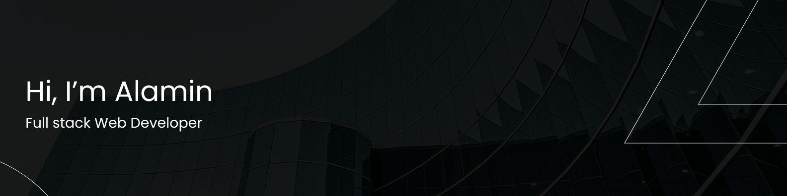

  

 

## 👨‍💻 About Me

I'm a Computer Science student at Daffodil International University, passionate about coding and creating impactful tech. I love building full-stack apps, exploring backend architecture, and diving deep into competitive programming challenges.
I’m always curious about new tech, constantly experimenting, and leveling up my skills in software development, backend systems, and competitive programming. Whether it's crafting real-world solutions or exploring fun side projects, I enjoy turning ideas into clean, working code.
Always building, always growing. Let’s connect and make something awesome!

 

## 🚀 Overview

- Currently Exploring: ***Competitive Programming (CP)***. Sharpening my problem-solving skills through coding challenges.
- Collaboration: I'm always open to collaborating on ***Open Source Projects***, hackathons, or any dev-related challenge!
- Always Learning: Currently leveling up my skills in  **Backend Development, System Design, and Competitive Programming** 

 

## ⚡ Competitive Programming

 
 
  
  
  

  

   

## 💻 Leetcode Stats

  
## 🌐 Socials

   
  

  
 

 

## 💼 Skills

    
    
    
    
    
    
    
    
    
    
    
    
    
    
    
    
    
    

 

## 🧰 Tools

  
  
  
  
  
  
  
  
  
  

  
 

## 📊 Stats

<!-->

  
  

 
<!-- 
-->

  
 

## ⚙️ My Coding Environment

### System

  
  
  
  

### Development

  
  
  
  
  

<!--### Theming

  

-->

 

<!-- 
## 🏆 GitHub Trophies

 

 ## ✍️ Random Dev Quote
 

  

 -->

<!--## 📝 Latest Blog Posts

 BLOG-POST-LIST:START 
- [🎨 Creating a Beautiful Portfolio with Tailwind and Framer Motion](https://portfolio-alamin-dev.vercel.app/blog/beautiful-portfolio) - *Apr 24, 2025*
- [⚡ How to Build Real-Time Chat Apps with Socket.io](https://portfolio-alamin-dev.vercel.app/blog/socket-chat) - *Apr 20, 2025*
- [🚀 React Performance Optimization: Tips & Best Practices](https://portfolio-alamin-dev.vercel.app/blog/react-performance) - *Apr 15, 2025*
- [📦 Setting Up a Fullstack App with MongoDB, Express, React & Node](https://portfolio-alamin-dev.vercel.app/blog/mern-stack) - *Apr 10, 2025*
- [🧠 Understanding useEffect in React — The Clean Way](https://portfolio-alamin-dev.vercel.app/blog/useeffect-guide) - *Apr 5, 2025*
<!-- BLOG-POST-LIST:END -->

<picture>
  <source media="(prefers-color-scheme: dark)" srcset="https://raw.githubusercontent.com/alamin147/alamin147/output/github-snake-dark.svg" />
  <source media="(prefers-color-scheme: light)" srcset="https://raw.githubusercontent.com/alamin147/alamin147/output/github-snake.svg" />
  
</picture>

  

